<picture>
  <source media="(prefers-color-scheme: dark)" srcset="assets/header-dark.svg">
  
</picture>

# EventEmitter

In-process application events for .NET, modeled on [Spring Modulith](https://docs.spring.io/spring-modulith/reference/events.html).

One part of your application publishes a plain event object. Other parts (often other modules or assemblies) react to it without either side referencing the other's services. Listeners are ordinary methods marked with an attribute; there are no listener interfaces or base classes to implement.

- **Synchronous listeners** (`[EventListener]`) run inline, in the publisher's DI scope and transaction.
- **Module listeners** (`[ApplicationModuleListener]`) run in the background, in their own DI scope, and only after the publisher's transaction commits.
- **Event publication registry**: every delivery to a module listener is tracked, so failed deliveries can be inspected and resubmitted.
- **Test helpers**: `PublishedEvents` and `Scenario` for asserting on events in integration tests.

Every capability has a runnable example; see [Running the samples](#running-the-samples) and [Examples](#examples).

## Contents

- [Requirements](#requirements)
- [Installation](#installation)
- [Quick start](#quick-start)
- [Writing listeners](#writing-listeners)
- [Registering listeners](#registering-listeners)
- [Modules in separate assemblies](#modules-in-separate-assemblies)
- [Transactions](#transactions)
- [Handling failures: the publication registry](#handling-failures-the-publication-registry)
- [Custom publication storage](#custom-publication-storage)
- [Configuration](#configuration)
- [Testing](#testing)
- [Things to know](#things-to-know)
- [Spring Modulith → EventEmitter](#spring-modulith--eventemitter)
- [Running the samples](#running-the-samples)
- [Examples](#examples)
- [Repository layout](#repository-layout)

## Requirements

- .NET 8 or .NET 10.
- The .NET Generic Host (`Host.CreateApplicationBuilder`) or ASP.NET Core (`WebApplication`). Module listeners run on a hosted service.

## Installation

The library isn't published to NuGet. Reference the project directly:

```xml
<ItemGroup>
  <ProjectReference Include="path\to\src\EventEmitter\EventEmitter.csproj" />
  <!-- Test projects only: -->
  <ProjectReference Include="path\to\src\EventEmitter.Testing\EventEmitter.Testing.csproj" />
</ItemGroup>
```

Public types live in the `Codefinity.EventEmitter` namespace (`Codefinity.EventEmitter.Testing` for the test helpers). The registration methods are in `Microsoft.Extensions.DependencyInjection`, so they show up on `IServiceCollection` without an extra `using`.

## Quick start

The code in this README comes from the samples in [samples/](samples/): a small shop split into Orders, Inventory and Shipping modules. Snippets marked *trimmed* leave lines out of the sample file; nothing is changed.

### 1. Define an event

An event is any object. Immutable records work best. The samples keep each module's public events in a separate `*.Events` project, so other modules can listen for them without referencing the module (see [Modules in separate assemblies](#modules-in-separate-assemblies)).

```csharp
// samples/EventEmitter.Sample.Orders.Events/OrderEvents.cs (trimmed)
namespace Codefinity.EventEmitter.Sample.Orders;

public sealed record OrderCompleted(string OrderId, string CustomerId) : IOrderEvent;
```

### 2. Publish it

Inject `IEventPublisher` and call `PublishAsync`:

```csharp
// samples/EventEmitter.Sample.Orders/OrderService.cs (trimmed; the full version also uses a transaction, see Transactions)
public sealed class OrderService(IEventPublisher events, ILogger<OrderService> logger)
{
    public async Task CompleteAsync(string orderId, string customerId, bool failBeforeCommit = false)
    {
        logger.LogInformation("Completing {OrderId} for {CustomerId}", orderId, customerId);

        // ...save the order here...
        await events.PublishAsync(new OrderCompleted(orderId, customerId));
    }
}
```

### 3. Listen for it

Put an attribute on any method whose first parameter is the event:

```csharp
// samples/EventEmitter.Sample.Inventory/InventoryListener.cs (trimmed)
namespace Codefinity.EventEmitter.Sample.Inventory;

internal sealed class InventoryListener(IEventPublisher events, ILogger<InventoryListener> logger)
{
    // Async, after commit, in its own DI scope.
    [ApplicationModuleListener(Id = "inventory.reserve-stock")]
    public async Task On(OrderCompleted evt, CancellationToken cancellationToken)
    {
        await Task.Delay(100, cancellationToken);
        logger.LogInformation("Reserved stock for {OrderId} (event from {Assembly})",
            evt.OrderId, evt.GetType().Assembly.GetName().Name);
    }
}
```

### 4. Register everything

Each module registers its own services and listeners, and the host composes the modules:

```csharp
// samples/EventEmitter.Sample.Orders/OrdersModule.cs
public static IServiceCollection AddOrdersModule(this IServiceCollection services)
{
    services.AddScoped<OrderService>();

    // Orders only publishes, so it needs the publisher but registers no listeners.
    services.AddEventEmitter();
    return services;
}

// samples/EventEmitter.Sample.Inventory/InventoryModule.cs
public static IServiceCollection AddInventoryModule(this IServiceCollection services)
{
    // Picks up InventoryListener, which is internal to this assembly.
    services.AddEventEmitter().AddListenersFromAssembly(typeof(InventoryModule).Assembly);
    return services;
}
```

```csharp
// The host
var builder = Host.CreateApplicationBuilder(args);
builder.Services
    .AddOrdersModule()
    .AddInventoryModule();

await builder.Build().RunAsync();
```

When `OrderService.CompleteAsync` runs, `PublishAsync` returns right away. `InventoryListener.On` then runs on a background worker in a fresh DI scope. See it run with `dotnet run --project samples/EventEmitter.Sample -- modules`.

### Using it from ASP.NET Core

Nothing changes except the host builder:

```csharp
// samples/EventEmitter.Sample.Web/Program.cs (trimmed)
var builder = WebApplication.CreateBuilder(args);

builder.Services
    .AddOrdersModule()
    .AddInventoryModule()
    .AddShippingModule();

var app = builder.Build();

app.MapPost("/orders/{orderId}/complete", async (string orderId, string customer, OrderService orders) =>
{
    await orders.CompleteAsync(orderId, customer);
    return Results.Accepted();   // Inventory and Shipping continue in the background
});

app.Run();
```

`IEventPublisher` is scoped, so each request gets its own publisher. Synchronous listeners share that request's scope.

## Writing listeners

### Synchronous vs. module listeners

| | `[EventListener]` | `[ApplicationModuleListener]` |
|---|---|---|
| Spring equivalent | `@EventListener` | `@ApplicationModuleListener` |
| Runs | Inline, before `PublishAsync` returns | On a background worker |
| DI scope | The publisher's scope | A new scope per delivery |
| Transaction | Inside the publisher's transaction | After it commits; skipped on rollback |
| Exceptions | Thrown from `PublishAsync` | Logged and recorded; the publication stays incomplete |
| Tracked in the registry | No | Yes |

Use `[EventListener]` when the reaction must succeed or fail together with the publisher's work, such as validation, audit rows in the same transaction, or updating a read model in the same unit of work. Use `[ApplicationModuleListener]` for everything else, especially work in another module, which shouldn't be able to slow down or break the publisher.

```csharp
// samples/EventEmitter.Sample/Audit/AuditListener.cs
public sealed class AuditListener(ILogger<AuditListener> logger)
{
    // Synchronous: runs inside OrderService's transaction, before PublishAsync returns.
    // IOrderEvent is an interface, so this receives OrderCompleted and OrderCancelled.
    [EventListener]
    public void On(IOrderEvent evt) =>
        logger.LogInformation("Audited {Event} for {OrderId}", evt.GetType().Name, evt.OrderId);
}
```

### Method signatures

A listener method:

- Takes the **event as its first parameter**. The parameter's type decides which events it receives.
- May take a **`CancellationToken` as its second parameter**, and nothing else.
- Returns **`void`, `Task`, `Task<T>` or `ValueTask`**. The result of `Task<T>` is ignored.
- Is an **instance method**. It can be `public`, `internal`, `protected` or `private`.

All of these are valid:

```csharp
// samples/EventEmitter.Sample/Examples/ListenerMethodsExample.cs
private sealed class ListenerShapes(ILogger<ListenerShapes> logger)
{
    [EventListener]
    public void ReturnsVoid(OrderCompleted evt) =>
        logger.LogInformation("sync    void ReturnsVoid(OrderCompleted)");

    [EventListener]
    public Task ReturnsTask(OrderCompleted evt, CancellationToken cancellationToken)
    {
        logger.LogInformation("sync    Task ReturnsTask(OrderCompleted, CancellationToken)");
        return Task.CompletedTask;
    }

    [EventListener]
    private ValueTask PrivateValueTask(OrderCompleted evt)
    {
        logger.LogInformation("sync    private ValueTask PrivateValueTask(OrderCompleted)");
        return ValueTask.CompletedTask;
    }

    [EventListener]
    internal Task<int> ReturnsTaskOfT(OrderCompleted evt)
    {
        logger.LogInformation("sync    internal Task<int> ReturnsTaskOfT(OrderCompleted); the result is ignored");
        return Task.FromResult(42);
    }

    [ApplicationModuleListener]
    public async Task AsyncWithToken(OrderCompleted evt, CancellationToken cancellationToken)
    {
        await Task.Delay(50, cancellationToken);
        logger.LogInformation("module  async Task AsyncWithToken(OrderCompleted, CancellationToken)");
    }

    [ApplicationModuleListener]
    private void AnotherEventType(OrderCancelled evt) =>
        logger.LogInformation("module  private void AnotherEventType(OrderCancelled)");
}
```

Run it with `dotnet run --project samples/EventEmitter.Sample -- listener-methods`.

For synchronous listeners, the token is the one passed to `PublishAsync`. For module listeners, it's cancelled only if the host's shutdown timeout runs out while the listener is still running (see [Configuration](#configuration)).

### Receiving a family of events

Because matching uses the parameter's type, a listener for a base type or interface receives every subtype:

```csharp
// samples/EventEmitter.Sample.Orders.Events/OrderEvents.cs
public interface IOrderEvent
{
    string OrderId { get; }
}

public sealed record OrderCompleted(string OrderId, string CustomerId) : IOrderEvent;

public sealed record OrderCancelled(string OrderId, string Reason) : IOrderEvent;
```

```csharp
// samples/EventEmitter.Sample/Examples/SupertypesExample.cs (trimmed)
private sealed class OrderTimeline(ILogger<OrderTimeline> logger)
{
    [ApplicationModuleListener]
    public void On(IOrderEvent evt) =>
        logger.LogInformation("IOrderEvent listener got {Event} for {OrderId}", evt.GetType().Name, evt.OrderId);
}

private sealed class EverythingListener(ILogger<EverythingListener> logger)
{
    [EventListener]
    public void On(object evt) =>
        logger.LogInformation("object listener got {Event}", evt.GetType().Name);
}
```

`OrderTimeline` receives `OrderCompleted` and `OrderCancelled`. A parameter of type `object` receives every event, which is also how the test helper `PublishedEvents` works. Run it with `dotnet run --project samples/EventEmitter.Sample -- supertypes`.

### Several listeners in one class

A class can hold any number of listener methods, for different events and in both modes. Inventory's listener handles both of Orders' events:

```csharp
// samples/EventEmitter.Sample.Inventory/InventoryListener.cs
internal sealed class InventoryListener(IEventPublisher events, ILogger<InventoryListener> logger)
{
    // Async, after commit, in its own DI scope.
    [ApplicationModuleListener(Id = "inventory.reserve-stock")]
    public async Task On(OrderCompleted evt, CancellationToken cancellationToken)
    {
        await Task.Delay(100, cancellationToken);
        logger.LogInformation("Reserved stock for {OrderId} (event from {Assembly})",
            evt.OrderId, evt.GetType().Assembly.GetName().Name);

        // Listeners can publish too: this one hands over to the Shipping module.
        await events.PublishAsync(new StockReserved(evt.OrderId, Items: 3), cancellationToken);
    }

    [ApplicationModuleListener(Id = "inventory.release-stock")]
    public void On(OrderCancelled evt) =>
        logger.LogInformation("Released stock for {OrderId}", evt.OrderId);
}
```

### Ordering synchronous listeners

Synchronous listeners for the same event run in ascending `Order` (default `0`). Listeners with the same order run in registration order.

```csharp
// samples/EventEmitter.Sample/Examples/OrderingExample.cs (trimmed)
private sealed class CheckoutSteps(ILogger<CheckoutSteps> logger)
{
    [EventListener(Order = 30)]
    public void Audit(OrderCompleted evt) => logger.LogInformation("3. Audit     (Order = 30)");

    [EventListener]
    public void Invoice(OrderCompleted evt) => logger.LogInformation("2. Invoice   (Order = 0, the default)");

    [EventListener(Order = -10)]
    public void Validate(OrderCompleted evt) => logger.LogInformation("1. Validate  (Order = -10)");
}
```

They run Validate, Invoice, Audit. Module listeners run concurrently, so they have no order.

### Listener ids

Every listener method has an id, which is stored with each of its publications. The default is:

```
{ListenerType.FullName}.{MethodName}({EventType.FullName})
```

For example, the `validation` example's `IdsListener.DefaultId` method gets:

```
EventEmitter.Sample.Examples.ValidationExample+IdsListener.DefaultId(EventEmitter.Sample.Orders.OrderCompleted)
```

Set an explicit `Id` when publications are stored durably, so renaming a class or method doesn't orphan publications that are still waiting to be delivered. All the sample modules do:

```csharp
[ApplicationModuleListener(Id = "inventory.reserve-stock")]
public async Task On(OrderCompleted evt, CancellationToken cancellationToken)
```

Ids must be unique across the application.

### Validation

Listener methods are checked when you register them. Mistakes fail immediately with an `InvalidOperationException` that names the class and method. For example, registering this class from the `validation` example:

```csharp
private sealed class ExtraParameter
{
    [EventListener]
    public void On(OrderCompleted evt, string note) { }
}
```

fails with:

```
Listener method 'EventEmitter.Sample.Examples.ValidationExample+ExtraParameter.On' has a second parameter of type 'String'; only a CancellationToken is allowed there.
```

These are rejected:

- No parameters, more than two, or a second parameter that isn't a `CancellationToken`.
- An event passed by `ref`, `in` or `out`.
- A return type other than `void`, `Task`, `Task<T>` or `ValueTask`.
- Static or generic methods.
- A method with both attributes.
- A duplicate listener id.
- A registered class with no listener methods, or an abstract or open generic class.

`dotnet run --project samples/EventEmitter.Sample -- validation` prints the error for each of these.

## Registering listeners

`AddEventEmitter()` returns an `EventEmitterBuilder`:

```csharp
builder.Services
    .AddEventEmitter(options => { /* see Configuration */ })
    .AddListener<AuditListener>()                                   // one class
    .AddListener(typeof(AuditListener))                             // same, non-generic
    .AddListenersFromAssembly(typeof(InventoryModule).Assembly)     // every class with listener methods
    .AddListenersFromAssemblyContaining<ShippingModule>();          // same, by a type in the assembly
```

Assembly scanning finds `internal` listeners too, which is how the sample modules register listeners that the host can't see.

- Listener classes are registered in DI as **scoped** services. If you've already registered the class yourself (for example as a singleton), your registration is kept.
- Listener classes are created by DI, so their constructors can take any registered service.
- Registering the same class twice is harmless.
- `AddEventEmitter()` can be called any number of times. Every call adds to the same registry and applies its options delegate, which is what lets each module register itself (next section).

## Modules in separate assemblies

The samples in [samples/](samples/) split a small shop into three module assemblies. Events are the only thing they share, and each module's events live in a separate events assembly:

```
EventEmitter.Sample.Orders.Events.dll         OrderCompleted, OrderCancelled (plain records, no dependencies)
EventEmitter.Sample.Inventory.Events.dll      StockReserved (plain record, no dependencies)
EventEmitter.Sample.Orders.dll                publishes OrderCompleted and OrderCancelled; knows nothing about the others
EventEmitter.Sample.Inventory.dll             listens for Orders' events; publishes StockReserved
EventEmitter.Sample.Shipping.dll              listens for StockReserved
EventEmitter.Sample.exe / .Web.dll            hosts: wire the modules together
```

**Modules never reference each other.** A module references only events assemblies, so it can see another module's event types but not its code:

```xml
<!-- samples/EventEmitter.Sample.Inventory/EventEmitter.Sample.Inventory.csproj -->
<ProjectReference Include="..\..\src\EventEmitter\EventEmitter.csproj" />
<ProjectReference Include="..\EventEmitter.Sample.Inventory.Events\EventEmitter.Sample.Inventory.Events.csproj" />
<!-- Orders' event types only; no reference to the Orders module itself. -->
<ProjectReference Include="..\EventEmitter.Sample.Orders.Events\EventEmitter.Sample.Orders.Events.csproj" />
```

**Each module keeps its listeners `internal`**, so events are the only way in. Orders and Inventory are shown in the [Quick start](#quick-start). Inventory's listener publishes its own event, `StockReserved`, which Shipping handles:

```csharp
// samples/EventEmitter.Sample.Inventory.Events/StockReserved.cs
public sealed record StockReserved(string OrderId, int Items);

// samples/EventEmitter.Sample.Shipping/ShippingListener.cs
internal sealed class ShippingListener(CarrierGateway carrier, ILogger<ShippingListener> logger)
{
    [ApplicationModuleListener(Id = "shipping.book-shipment")]
    public void On(StockReserved evt)
    {
        var trackingNumber = carrier.Book(evt.OrderId);
        logger.LogInformation("Booked shipment {TrackingNumber} for {OrderId} (event from {Assembly})",
            trackingNumber, evt.OrderId, evt.GetType().Assembly.GetName().Name);
    }
}

// samples/EventEmitter.Sample.Shipping/ShippingModule.cs
public static IServiceCollection AddShippingModule(this IServiceCollection services)
{
    services.TryAddSingleton<CarrierGateway>();
    services.AddEventEmitter().AddListenersFromAssembly(typeof(ShippingModule).Assembly);
    return services;
}
```

**The host only composes them**, and can add listeners of its own:

```csharp
// samples/EventEmitter.Sample/Examples/ModulesExample.cs (trimmed)
await using var app = await ExampleApp.StartAsync(services => services
    .AddOrdersModule()       // EventEmitter.Sample.Orders.dll
    .AddInventoryModule()    // EventEmitter.Sample.Inventory.dll
    .AddShippingModule()     // EventEmitter.Sample.Shipping.dll
    .AddEventEmitter()
    .AddListener<AuditListener>());
```

The resulting project references:

```
Orders     -> Orders.Events
Inventory  -> Inventory.Events, Orders.Events
Shipping   -> Inventory.Events
hosts      -> Orders, Inventory, Shipping
```

To add a module, put its public events in a `<Module>.Events` project with no dependencies. Other modules reference that project, never the module itself.

### Module project vs. events project

Each module is split into two projects. Taking Orders as the example:

| | `EventEmitter.Sample.Orders` (module) | `EventEmitter.Sample.Orders.Events` (events) |
|---|---|---|
| **Holds** | Behaviour: services, listeners, persistence, DI registration | Data only: the event records, plus any shared event interface such as `IOrderEvent` |
| **Depends on** | EventEmitter, its own events project, and the events projects of modules it listens to | Nothing: not EventEmitter, not other modules |
| **Referenced by** | Hosts only (`EventEmitter.Sample`, `EventEmitter.Sample.Web`, the tests) | The module that publishes the events, and every module that listens for them |
| **Visibility** | Mostly `internal`; public only for what the host needs (`AddOrdersModule`, `OrderService`) | Everything `public` |
| **Changes** | Freely, since nothing outside the module compiles against it except the host | Carefully, because every listening module compiles against it |

**The events project** is the module's public contract. It holds only what other modules may see:

```csharp
// samples/EventEmitter.Sample.Orders.Events/OrderEvents.cs
namespace Codefinity.EventEmitter.Sample.Orders;

public interface IOrderEvent
{
    string OrderId { get; }
}

public sealed record OrderCompleted(string OrderId, string CustomerId) : IOrderEvent;

public sealed record OrderCancelled(string OrderId, string Reason) : IOrderEvent;
```

```xml
<!-- samples/EventEmitter.Sample.Orders.Events/EventEmitter.Sample.Orders.Events.csproj (trimmed) -->
<Project Sdk="Microsoft.NET.Sdk">
  <PropertyGroup>
    <TargetFramework>net10.0</TargetFramework>
  </PropertyGroup>
  <!-- No references. An event is any object, so it doesn't need EventEmitter. -->
</Project>
```

**The module project** holds everything else. It publishes the events, registers itself, and keeps its internals hidden:

```csharp
// samples/EventEmitter.Sample.Orders/OrderService.cs (trimmed)
public sealed class OrderService(IEventPublisher events, ILogger<OrderService> logger)
{
    public async Task CompleteAsync(string orderId, string customerId, bool failBeforeCommit = false)
    {
        // ...save the order here...
        await events.PublishAsync(new OrderCompleted(orderId, customerId));
    }
}

// samples/EventEmitter.Sample.Orders/OrdersModule.cs
public static IServiceCollection AddOrdersModule(this IServiceCollection services)
{
    services.AddScoped<OrderService>();
    services.AddEventEmitter();
    return services;
}
```

```xml
<!-- samples/EventEmitter.Sample.Orders/EventEmitter.Sample.Orders.csproj -->
<ProjectReference Include="..\..\src\EventEmitter\EventEmitter.csproj" />
<ProjectReference Include="..\EventEmitter.Sample.Orders.Events\EventEmitter.Sample.Orders.Events.csproj" />
```

A listening module references only the events project, so it can take `OrderCompleted` as a parameter but can't see `OrderService`:

```csharp
// samples/EventEmitter.Sample.Inventory/InventoryListener.cs (trimmed)
using Codefinity.EventEmitter.Sample.Orders;   // resolves to Orders.Events: OrderCompleted, OrderCancelled

internal sealed class InventoryListener(IEventPublisher events, ILogger<InventoryListener> logger)
{
    [ApplicationModuleListener(Id = "inventory.reserve-stock")]
    public async Task On(OrderCompleted evt, CancellationToken cancellationToken) { /* ... */ }
}

// Doesn't compile in Inventory: OrderService lives in the Orders module, which Inventory doesn't reference.
// internal sealed class InventoryListener(OrderService orders) { ... }
```

The events project and the module share the namespace `Codefinity.EventEmitter.Sample.Orders`, so the same `using` works in both. The assembly that a type comes from decides what a module can reach, not the namespace.

#### Why not reference the module directly?

EventEmitter matches listeners by CLR type, so a listener needs the event's type at compile time. It doesn't need anything else from the publishing module. Referencing the whole module brings in more than the event:

1. **Direct calls creep in.** With a reference to `EventEmitter.Sample.Orders`, nothing stops Inventory from injecting `OrderService` and calling `CancelAsync`. The modules are then coupled through code, not events. With only `Orders.Events`, that code doesn't compile.
2. **Two-way conversations become impossible.** Suppose Orders later needs to react to `StockReserved`, for example to mark the order as ready to ship.

   ```
   Referencing modules:              Referencing events projects:
     Inventory -> Orders               Inventory -> Orders.Events
     Orders    -> Inventory   ✗        Orders    -> Inventory.Events   ✓
     (circular project reference;
      MSBuild refuses to build it)
   ```

   Events projects never reference anything, so they can't form a cycle, however the modules end up talking to each other.

#### What goes where

| Type | Project | Why |
|---|---|---|
| `OrderCompleted`, `OrderCancelled` | `Orders.Events` | Other modules listen for them |
| `IOrderEvent` | `Orders.Events` | Listeners use it to receive every order event (see `AuditListener`) |
| `OrderService` | `Orders` | Behaviour; only the host calls it |
| `OrdersModule.AddOrdersModule` | `Orders` | Registration; only the host calls it |
| A listener class, such as `InventoryListener` | The module that owns it, `internal` | Reached only through events |
| An internal event that no other module listens for | The module, `internal` | Keeps the public contract small |
| An enum or value type used inside an event (for example an `OrderStatus` field) | The events project | Listeners need it to read the event |

Keep events plain: records of primitive values, other event-project types, and nothing that pulls in a dependency such as an EF entity or a DTO from the module. If an event needs a type from the module, the type belongs in the events project, or the event should carry the primitive values instead.

#### Changing an event

Listening modules compile against the events project, so treat a change to it as a change to a public API:

- **Adding a property** is safe if it's optional (has a default), because existing `new OrderCompleted(...)` calls and listeners keep compiling.
- **Renaming or removing a property**, or **renaming the type**, breaks every listener. Add a new event instead and remove the old one once nothing listens for it.
- **With durable storage**, incomplete publications are stored and republished later, possibly by a newer build. Keep changes backward compatible, or complete the outstanding publications before you deploy the change. See [Custom publication storage](#custom-publication-storage).
- **Moving an event to another assembly** counts as renaming the type, even when the namespace stays the same. Repositories store `EventType.AssemblyQualifiedName`, which includes the assembly name, so a publication stored as `Codefinity.EventEmitter.Sample.Orders.OrderCompleted, EventEmitter.Sample.Orders` no longer resolves once `OrderCompleted` lives in `EventEmitter.Sample.Orders.Events`. Complete the outstanding publications before you move the event, or have your repository map the old assembly name to the new one when it loads a publication.

## Transactions

Module listeners wait for the publisher's **ambient transaction** (`System.Transactions.Transaction.Current`):

```csharp
// samples/EventEmitter.Sample.Orders/OrderService.cs (trimmed)
public async Task CompleteAsync(string orderId, string customerId, bool failBeforeCommit = false)
{
    using var transaction = new TransactionScope(TransactionScopeAsyncFlowOption.Enabled);

    logger.LogInformation("Completing {OrderId} for {CustomerId}", orderId, customerId);

    // ...save the order here...
    await events.PublishAsync(new OrderCompleted(orderId, customerId));

    if (failBeforeCommit)
    {
        throw new InvalidOperationException($"Payment for {orderId} was declined.");
    }

    transaction.Complete();
    logger.LogInformation("Committed {OrderId}", orderId);
}
```

When `PublishAsync` returns, `AuditListener` (an `[EventListener]`) has already run inside the transaction, but `InventoryListener` (an `[ApplicationModuleListener]`) hasn't. When `transaction` is disposed at the end of the method, the transaction commits and Inventory's delivery is queued. With `failBeforeCommit: true`, the exception skips `Complete()`, the transaction rolls back, and Inventory never hears about the order. The `transactions` example runs both cases:

```
  [thread  9] OrderService         Completing order-1 for alice
  [thread  9] AuditListener        Audited OrderCompleted for order-1
  [thread  9] OrderService         Committed order-1
  [thread  9] InventoryListener    Reserved stock for order-1 (event from EventEmitter.Sample.Orders.Events)
  [thread 14] ShippingListener     Booked shipment TRK-order-1 for order-1 (event from EventEmitter.Sample.Inventory.Events)
  ...
  [thread 14] OrderService         Completing order-2 for bob
  [thread 14] AuditListener        Audited OrderCompleted for order-2
  [thread 14] Example              Caught: Payment for order-2 was declined.
  [thread 14] Example                shipment for order-2: none
  [thread 14] Example                publications left waiting: 0 (the rollback deleted them)
```

| What happens | `[EventListener]` | `[ApplicationModuleListener]` |
|---|---|---|
| No ambient transaction | Runs inline | Queued immediately |
| Transaction commits | Already ran inline | Queued at commit |
| Transaction rolls back (no `Complete()`, or an exception) | Already ran inline | Never runs; its publications are deleted |

> **Always pass `TransactionScopeAsyncFlowOption.Enabled`.** Without it the transaction doesn't flow across `await`, the publisher sees no transaction, and module listeners run before your data is committed.

### Other transaction mechanisms

If you manage transactions another way (for example EF Core's `BeginTransactionAsync`), implement `ITransactionSynchronization` and register it:

```csharp
public interface ITransactionSynchronization
{
    bool IsTransactionActive { get; }

    // Call onCompleted(true) after commit, onCompleted(false) after rollback.
    void RegisterAfterCompletion(Action<bool> onCompleted);
}
```

The implementation is registered as a **singleton**, so it must find the current transaction itself. The `unit-of-work` example tracks a minimal unit of work in an `AsyncLocal<T>`:

```csharp
// samples/EventEmitter.Sample/Examples/UnitOfWorkExample.cs (trimmed)
private sealed class UnitOfWork : IDisposable
{
    private static readonly AsyncLocal<UnitOfWork?> CurrentSlot = new();
    private readonly List<Action<bool>> _onCompleted = [];

    public static UnitOfWork? Current => CurrentSlot.Value;

    public bool IsCompleted { get; private set; }

    public static UnitOfWork Begin() => CurrentSlot.Value = new UnitOfWork();

    public void OnCompleted(Action<bool> callback) => _onCompleted.Add(callback);

    public void Commit() => Complete(committed: true);

    public void Dispose()
    {
        if (!IsCompleted)
        {
            Complete(committed: false);
        }
    }

    private void Complete(bool committed)
    {
        IsCompleted = true;
        CurrentSlot.Value = null;
        foreach (var callback in _onCompleted)
        {
            callback(committed);
        }
    }
}

/// <summary>Tells EventEmitter about the current unit of work.</summary>
private sealed class UnitOfWorkSynchronization : ITransactionSynchronization
{
    public bool IsTransactionActive => UnitOfWork.Current is { IsCompleted: false };

    public void RegisterAfterCompletion(Action<bool> onCompleted) => UnitOfWork.Current!.OnCompleted(onCompleted);
}
```

Register it, and publish inside a unit of work:

```csharp
// samples/EventEmitter.Sample/Examples/UnitOfWorkExample.cs (simplified: narration replaced by a comment)
await using var app = await ExampleApp.StartAsync(services => services
    .AddInventoryModule()
    .AddEventEmitter()
    .UseTransactionSynchronization<UnitOfWorkSynchronization>());

using (var unitOfWork = UnitOfWork.Begin())
{
    await app.PublishAsync(new OrderCompleted("order-1", "alice"));
    // ...Inventory hasn't run yet...
    unitOfWork.Commit();
}
```

In a real app, `Commit` would save the `DbContext` and commit its database transaction before notifying the callbacks.

## Handling failures: the publication registry

Each time an event is published, one **publication** is recorded per matching module listener:

```csharp
public sealed record EventPublication(Guid Id, object Event, Type EventType, string ListenerId, DateTimeOffset PublicationDate)
{
    public DateTimeOffset? CompletionDate { get; init; }   // set when the listener succeeds
    public string? LastFailure { get; init; }             // exception text of the latest failure
    public int Attempts { get; init; }                   // deliveries tried so far
    public bool IsCompleted { get; }
}
```

If a module listener throws, the exception is logged and stored in `LastFailure`, and the publication stays **incomplete**. Other listeners for the same event aren't affected, because each has its own publication. Nothing is retried automatically; you decide when to resubmit.

### Inspecting and resubmitting

Inject `IIncompleteEventPublications`:

```csharp
public interface IIncompleteEventPublications
{
    Task<IReadOnlyList<EventPublication>> FindAllAsync(CancellationToken cancellationToken = default);
    Task<int> ResubmitAsync(Func<EventPublication, bool> filter, CancellationToken cancellationToken = default);
    Task<int> ResubmitOlderThanAsync(TimeSpan age, CancellationToken cancellationToken = default);
}
```

Both resubmit methods return how many publications were queued. Publications that are already queued, currently running, or still waiting for their transaction to commit are skipped, so resubmitting never delivers the same publication twice at once.

**Admin endpoints:**

```csharp
// samples/EventEmitter.Sample.Web/Program.cs (trimmed)
var events = app.MapGroup("/admin/events");

events.MapGet("/incomplete", async (IIncompleteEventPublications incomplete) =>
    (await incomplete.FindAllAsync()).Select(Summarize));

// POST /admin/events/resubmit                             everything incomplete
// POST /admin/events/resubmit?listenerId=shipping.book-shipment
// POST /admin/events/resubmit?olderThanSeconds=60
events.MapPost("/resubmit", async (IIncompleteEventPublications incomplete, string? listenerId, int? olderThanSeconds) =>
{
    var count = olderThanSeconds is { } seconds
        ? await incomplete.ResubmitOlderThanAsync(TimeSpan.FromSeconds(seconds))
        : await incomplete.ResubmitAsync(p => listenerId is null || p.ListenerId == listenerId);

    return Results.Ok(new { resubmitted = count });
});

static object Summarize(EventPublication p) => new
{
    p.Id,
    p.ListenerId,
    EventType = p.EventType.Name,
    p.Event,
    p.PublicationDate,
    p.CompletionDate,
    p.Attempts,
    LastFailure = p.LastFailure?.Split('\n')[0].Trim(),
};
```

With the carrier down, `GET /admin/events/incomplete` returns:

```json
[{"id":"6dcdbf3a-8e2b-4f54-a805-1c6fb1a66090","listenerId":"shipping.book-shipment","eventType":"StockReserved","event":{"orderId":"order-2","items":3},"publicationDate":"2026-09-30T06:02:23.0271155+00:00","completionDate":null,"attempts":1,"lastFailure":"System.InvalidOperationException: Carrier API is unavailable."}]
```

**Resubmitting one listener after a fix**, from the `resubmit` example:

```csharp
// samples/EventEmitter.Sample/Examples/ResubmitExample.cs (trimmed)
carrier.IsAvailable = true;
var count = await incomplete.ResubmitAsync(p => p.ListenerId == "shipping.book-shipment");
```

**A periodic retry job with an attempt limit**, from the `retry-job` example:

```csharp
// samples/EventEmitter.Sample/Examples/RetryJobExample.cs (trimmed)
private sealed record RetryPolicy(TimeSpan Interval, int MaxAttempts);

private sealed class RetryFailedEvents(
    IIncompleteEventPublications incomplete,
    RetryPolicy policy,
    ILogger<RetryFailedEvents> logger) : BackgroundService
{
    protected override async Task ExecuteAsync(CancellationToken stoppingToken)
    {
        using var timer = new PeriodicTimer(policy.Interval);

        while (await timer.WaitForNextTickAsync(stoppingToken))
        {
            // Attempts > 0: it has failed at least once. Below the maximum: we haven't given up on it.
            var count = await incomplete.ResubmitAsync(
                p => p.Attempts > 0 && p.Attempts < policy.MaxAttempts,
                stoppingToken);

            if (count > 0)
            {
                logger.LogInformation("Resubmitted {Count} failed publication(s)", count);
            }
        }
    }
}
```

```csharp
services.AddSingleton(new RetryPolicy(Interval: TimeSpan.FromMilliseconds(300), MaxAttempts: 3));
services.AddHostedService<RetryFailedEvents>();
```

The example uses a 300 ms interval so it finishes quickly; in production you'd use minutes.

### Completed publications

With the default `CompletionMode.Update`, completed publications are kept with a `CompletionDate`. Read and clean them up through `ICompletedEventPublications`:

```csharp
public interface ICompletedEventPublications
{
    Task<IReadOnlyList<EventPublication>> FindAllAsync(CancellationToken cancellationToken = default);
    Task DeletePublicationsOlderThanAsync(TimeSpan age, CancellationToken cancellationToken = default);
}
```

```csharp
// samples/EventEmitter.Sample/Examples/CompletionModesExample.cs (trimmed)
await completed.DeletePublicationsOlderThanAsync(TimeSpan.FromDays(7));
```

To not keep them at all, set `CompletionMode.Delete` (see [Configuration](#configuration)). The `completion-modes` example shows both modes.

## Custom publication storage

The default `InMemoryEventPublicationRepository` loses incomplete publications when the process exits. To keep them across restarts, implement `IEventPublicationRepository` over your database.

A complete, working implementation that stores publications in a JSON file is in [JsonFileEventPublicationRepository.cs](samples/EventEmitter.Sample/Infrastructure/JsonFileEventPublicationRepository.cs). For a database, the shape is the same; this outline is not in the samples:

```csharp
public sealed class SqlEventPublicationRepository(/* your DB access */) : IEventPublicationRepository
{
    public Task CreateAsync(IReadOnlyCollection<EventPublication> publications, CancellationToken ct = default)
    {
        // INSERT one row per publication. Serialize p.Event (e.g. System.Text.Json) and store
        // p.EventType.AssemblyQualifiedName so the event can be deserialized later.
    }

    public Task MarkCompletedAsync(Guid id, DateTimeOffset completionDate, CancellationToken ct = default)
    {
        // UPDATE … SET CompletionDate = @completionDate, Attempts = Attempts + 1 WHERE Id = @id
    }

    public Task MarkFailedAsync(Guid id, string failure, CancellationToken ct = default)
    {
        // UPDATE … SET LastFailure = @failure, Attempts = Attempts + 1 WHERE Id = @id
    }

    public Task<IReadOnlyList<EventPublication>> FindIncompleteAsync(CancellationToken ct = default)
    {
        // SELECT … WHERE CompletionDate IS NULL ORDER BY PublicationDate; deserialize each event
    }

    public Task<IReadOnlyList<EventPublication>> FindCompletedAsync(CancellationToken ct = default) { ... }

    public Task DeleteAsync(IReadOnlyCollection<Guid> ids, CancellationToken ct = default) { ... }

    public Task DeleteCompletedBeforeAsync(DateTimeOffset cutoff, CancellationToken ct = default) { ... }
}
```

Rules for implementations:

- **Register as a singleton.** It's called from background workers, so it must be thread-safe and must not depend on scoped services directly. Use `IServiceScopeFactory` or `IDbContextFactory<T>` inside it.
- **Ignore unknown ids** in `MarkCompletedAsync`, `MarkFailedAsync` and `DeleteAsync`. A publication can be deleted (after a rollback, or in `Delete` mode) while another operation on it is in flight.
- **Return results oldest first.**

Register it with `UsePublicationRepository<TRepository>()`, or pass an instance. Turn on republishing so that publications left incomplete by a crash or restart are delivered again on startup. From the `durable-storage` example's second run:

```csharp
// samples/EventEmitter.Sample/Examples/DurableStorageExample.cs (trimmed)
services
    .AddEventEmitter(o => o.RepublishOutstandingEventsOnStartup = true)
    .UsePublicationRepository(new JsonFileEventPublicationRepository(path))
    .AddListener<InvoiceListener>();
```

Republishing matches publications to listeners by **listener id**, which is why durable setups should give their module listeners explicit ids. The example's listener uses `[ApplicationModuleListener(Id = "billing.create-invoice")]`. Its output shows the whole cycle: the first run is stopped mid-invoice, and the second run delivers the stored publication:

```
  [thread 22] EventEmitter         WARN: Event listeners did not finish within the shutdown timeout; cancelling them. Unfinished publications stay incomplete.
  [thread  7] EventEmitter         ERROR: Listener billing.create-invoice failed to handle OrderCompleted (publication 47bfbf23-…); the publication stays incomplete. -> TaskCanceledException: A task was canceled.
  Left in the file: billing.create-invoice <- OrderCompleted (incomplete, attempts: 1, last failure: System.Threading.Tasks.TaskCanceledException: A task was canceled.)
  Run 2: a new process starts with RepublishOutstandingEventsOnStartup = true, and invoices are fast again:
  [thread 10] EventEmitter         Republished 1 outstanding event publication(s).
  [thread  7] InvoiceListener      Creating the invoice for order-1...
  [thread 10] InvoiceListener      Invoice for order-1 created
```

> `CreateAsync` is called inside the publisher's ambient `TransactionScope`. A connection your repository opens there (for example with `SqlConnection`, which enlists by default) joins that transaction. The publication rows then commit or roll back together with your business data, the same way Spring Modulith's JPA and JDBC registries work. All other repository calls happen outside any ambient transaction.

## Configuration

```csharp
builder.Services.AddEventEmitter(o =>
{
    o.CompletionMode = CompletionMode.Update;
    o.RepublishOutstandingEventsOnStartup = false;
    o.MaxDegreeOfParallelism = Environment.ProcessorCount;
    o.ShutdownTimeout = TimeSpan.FromSeconds(30);
});
```

| Option | Default | Meaning |
|---|---|---|
| `CompletionMode` | `Update` | `Update` keeps completed publications with a `CompletionDate`. `Delete` removes them. |
| `RepublishOutstandingEventsOnStartup` | `false` | Delivers the repository's incomplete publications again when the host starts. Only useful with durable storage. |
| `MaxDegreeOfParallelism` | processor count | How many module listeners may run at the same time. Must be at least 1. |
| `ShutdownTimeout` | 30 seconds | On shutdown, how long to wait for queued and running module listeners. After that, running listeners' tokens are cancelled and anything left stays incomplete. |

Options are standard `IOptions<EventEmitterOptions>`, so you can also bind them from configuration, as the web sample does:

```csharp
// samples/EventEmitter.Sample.Web/Program.cs (trimmed)
builder.Services
    .AddOrdersModule()
    .AddInventoryModule()
    .AddShippingModule();

// Options from the "EventEmitter" section of appsettings.json.
builder.Services.Configure<EventEmitterOptions>(builder.Configuration.GetSection("EventEmitter"));
```

```json
// samples/EventEmitter.Sample.Web/appsettings.json (trimmed)
"EventEmitter": {
  "CompletionMode": "Update",
  "MaxDegreeOfParallelism": 4,
  "ShutdownTimeout": "00:00:10"
}
```

The library also uses the registered `TimeProvider` (default `TimeProvider.System`) for publication and completion dates. Register your own before `AddEventEmitter()` to control time. The `resubmit` and `completion-modes` examples do this with a [ManualClock](samples/EventEmitter.Sample/Infrastructure/ManualClock.cs):

```csharp
// samples/EventEmitter.Sample/Examples/ResubmitExample.cs (trimmed)
var clock = new ManualClock();
await using var app = await ExampleApp.StartAsync(services => services
    .AddSingleton<TimeProvider>(clock)    // before AddEventEmitter(), so the library uses it
    .AddOrdersModule()
    .AddInventoryModule()
    .AddShippingModule());
```

## Testing

Reference `EventEmitter.Testing` and call `AddEventEmitterTesting()`. It registers:

- **`PublishedEvents`**, which records every event published in the app, including events published by listeners.
- **`Scenario`**, which runs an action and waits for the event or state change it causes. That's essential when the effect happens in a background module listener.

All the code below is from [ShopModuleTests.cs](samples/EventEmitter.Sample.Tests/ShopModuleTests.cs), which tests the sample modules.

### Test host setup (xUnit)

Each test gets its own host, so state doesn't leak between tests:

```csharp
// samples/EventEmitter.Sample.Tests/ShopModuleTests.cs (trimmed)
public sealed class ShopModuleTests : IAsyncLifetime
{
    private IHost _host = null!;

    private Scenario Scenario => _host.Services.GetRequiredService<Scenario>();

    private PublishedEvents Published => _host.Services.GetRequiredService<PublishedEvents>();

    private CarrierGateway Carrier => _host.Services.GetRequiredService<CarrierGateway>();

    public async Task InitializeAsync()
    {
        var builder = Host.CreateApplicationBuilder(new HostApplicationBuilderSettings { DisableDefaults = true });
        builder.Services
            .AddOrdersModule()
            .AddInventoryModule()
            .AddShippingModule()
            .AddEventEmitterTesting();

        _host = builder.Build();
        await _host.StartAsync();
    }

    public async Task DisposeAsync()
    {
        await _host.StopAsync();
        _host.Dispose();
    }
}
```

Starting the host matters, because it starts the background workers that run module listeners.

### Waiting for an event

`Stimulate` runs your action in a new DI scope. `ToArriveAsync` waits until a matching event is published after the action started, and returns that event. The default timeout is `Scenario.DefaultTimeout` (5 seconds).

```csharp
[Fact]
public async Task Completing_an_order_reserves_stock()
{
    // Wait for an event published by another assembly's background listener.
    var reserved = await Scenario
        .Stimulate(sp => sp.GetRequiredService<OrderService>().CompleteAsync("order-1", "alice"))
        .AndWaitForEventOfType<StockReserved>()
        .Matching(e => e.OrderId == "order-1")
        .ToArriveAsync();

    Assert.Equal(3, reserved.Items);
}
```

To publish an event directly as the stimulus, with an explicit timeout:

```csharp
[Fact]
public async Task Inventory_reacts_to_an_OrderCompleted_published_directly()
{
    // Publish the event itself as the stimulus, bypassing OrderService.
    await Scenario
        .Publish(new OrderCompleted("order-5", "dave"))
        .AndWaitForEventOfType<StockReserved>()
        .Matching(e => e.OrderId == "order-5")
        .ToArriveAsync(TimeSpan.FromSeconds(2));
}
```

`AndWaitForEventOfType` also takes a base type or interface, and `Matching` can test for a specific subtype:

```csharp
[Fact]
public async Task Cancelling_an_order_publishes_an_order_event()
{
    await Scenario
        .Stimulate(sp => sp.GetRequiredService<OrderService>().CancelAsync("order-3", "changed mind"))
        .AndWaitForEventOfType<IOrderEvent>()
        .Matching(e => e is OrderCancelled { Reason: "changed mind" })
        .ToArriveAsync();
}
```

`Matching` calls can be chained, and all of them must pass. If nothing matches in time, a `TimeoutException` names the expected event type.

### Waiting for a state change

When a listener changes state rather than publishing an event, poll for the state. The supplier runs in a new DI scope on each poll. By default any value that is non-null and not `false` is accepted:

```csharp
[Fact]
public async Task Completing_an_order_books_a_shipment()
{
    // Wait for state changed two modules away.
    var trackingNumber = await Scenario
        .Stimulate(sp => sp.GetRequiredService<OrderService>().CompleteAsync("order-1", "alice"))
        .AndWaitForStateChange(sp => sp.GetRequiredService<CarrierGateway>().Shipments.GetValueOrDefault("order-1"))
        .ToHappenAsync();

    Assert.Equal("TRK-order-1", trackingNumber);
}
```

Pass `acceptWhen` for any other condition:

```csharp
[Fact]
public async Task Waits_for_a_custom_condition()
{
    var shipmentCount = await Scenario
        .Publish(new OrderCompleted("order-6", "erin"))
        .AndWaitForStateChange(
            sp => sp.GetRequiredService<CarrierGateway>().Shipments.Count,
            acceptWhen: count => count >= 1)
        .ToHappenAsync();

    Assert.Equal(1, shipmentCount);
}
```

### Asserting on published events, and on events that never arrive

```csharp
[Fact]
public async Task A_rolled_back_order_reaches_no_other_module()
{
    await using (var scope = _host.Services.CreateAsyncScope())
    {
        await Assert.ThrowsAsync<InvalidOperationException>(() => scope.ServiceProvider
            .GetRequiredService<OrderService>()
            .CompleteAsync("order-2", "bob", failBeforeCommit: true));
    }

    // Waiting for StockReserved must time out: Inventory never saw the event.
    await Assert.ThrowsAsync<TimeoutException>(() => Scenario
        .Stimulate(_ => Task.CompletedTask)
        .AndWaitForEventOfType<StockReserved>()
        .ToArriveAsync(TimeSpan.FromMilliseconds(300)));

    // OrderCompleted was published (and recorded) before the rollback.
    Assert.Single(Published.OfType<OrderCompleted>().Matching(e => e.OrderId == "order-2"));
    Assert.Empty(Published.OfType<StockReserved>());
}
```

- `PublishedEvents.OfType<T>()` works with base types and interfaces too, for example `Published.OfType<IOrderEvent>()`.
- `All` returns every recorded event.
- `Clear()` resets the recording.

Events are recorded even when a synchronous listener throws, because the recorder runs first.

### Testing failure handling

```csharp
[Fact]
public async Task Failed_shipments_can_be_resubmitted()
{
    var incomplete = _host.Services.GetRequiredService<IIncompleteEventPublications>();
    Carrier.IsAvailable = false;

    await Scenario
        .Stimulate(sp => sp.GetRequiredService<OrderService>().CompleteAsync("order-4", "carol"))
        .AndWaitForStateChange(_ => HasFailedShipment(incomplete))
        .ToHappenAsync();

    Carrier.IsAvailable = true;

    // The stimulus can be any async call, here the resubmit itself.
    var trackingNumber = await Scenario
        .Stimulate(sp => sp.GetRequiredService<IIncompleteEventPublications>()
            .ResubmitAsync(p => p.ListenerId == "shipping.book-shipment"))
        .AndWaitForStateChange(sp => sp.GetRequiredService<CarrierGateway>().Shipments.GetValueOrDefault("order-4"))
        .ToHappenAsync();

    Assert.Equal("TRK-order-4", trackingNumber);
}

// The in-memory repository completes synchronously, so this doesn't block.
private static bool HasFailedShipment(IIncompleteEventPublications incomplete) =>
    incomplete.FindAllAsync().Result.Any(p => p.ListenerId == "shipping.book-shipment" && p.Attempts == 1);
```

`HasFailedShipment` uses `.Result` only because the state supplier is synchronous and the in-memory repository has already finished; don't do this with a database-backed repository.

To test time-based behaviour such as `ResubmitOlderThanAsync` or `DeletePublicationsOlderThanAsync`, register a `TimeProvider` you control before `AddEventEmitter()` (see [Configuration](#configuration)).

## Things to know

- **A failing synchronous listener stops the publish.** If an `[EventListener]` throws, the exception comes out of `PublishAsync` and no module-listener publications are created for that event. Usually your transaction then rolls back as well.
- **Module listeners need a running host.** Their events are queued in memory and delivered by a hosted service. In a bare `ServiceProvider` without a host, they're queued but never delivered.
- **Resolve `IEventPublisher` from a scope.** It's scoped, and synchronous listeners are resolved from the same scope. Inject it into scoped or transient services, or create a scope in singletons and background services.
- **Events are shared by reference.** In memory, every listener receives the same object instance, so keep events immutable.
- **No automatic retries.** Failed deliveries wait for you to resubmit them, as in the [retry job example](#inspecting-and-resubmitting).
- **In-memory by default.** Without a durable repository, publications that are incomplete when the process stops are lost.
- **Not included:** sending events to a message broker (Spring's `@Externalized`), and verifying module boundaries (Spring's `ApplicationModules.verify()`).

## Spring Modulith → EventEmitter

| Spring Modulith | EventEmitter |
|---|---|
| `ApplicationEventPublisher.publishEvent(e)` | `IEventPublisher.PublishAsync(e)` |
| `@EventListener` | `[EventListener]` |
| `@ApplicationModuleListener` | `[ApplicationModuleListener]` |
| `@Order` | `[EventListener(Order = n)]` |
| `@Transactional` | `TransactionScope` with `TransactionScopeAsyncFlowOption.Enabled` |
| `@EnableAsync` + task executor | Built in; see `MaxDegreeOfParallelism` |
| Event Publication Registry | `IEventPublicationRepository` (in memory by default) |
| `IncompleteEventPublications` | `IIncompleteEventPublications` |
| `CompletedEventPublications` | `ICompletedEventPublications` |
| `spring.modulith.events.completion-mode` | `EventEmitterOptions.CompletionMode` |
| `spring.modulith.events.republish-outstanding-events-on-restart` | `EventEmitterOptions.RepublishOutstandingEventsOnStartup` |
| `Scenario` | `Scenario` (`Codefinity.EventEmitter.Testing`) |
| `PublishedEvents` | `PublishedEvents` (`Codefinity.EventEmitter.Testing`) |

## Running the samples

Run all commands from the repository root, the folder that contains `EventEmitter.slnx`.

### 1. Check prerequisites

- **.NET 10 SDK.** Run `dotnet --list-sdks` and look for a `10.0.x` entry; if there isn't one, install it from [dot.net](https://dot.net). The samples and tests target .NET 10. The library also targets .NET 8, and the .NET 10 SDK builds both.
- **Optional, for the web sample:** a way to send the requests in the `.http` file:
  - VS Code with the REST Client extension.
  - Visual Studio 2022 17.6 or later.
  - Plain `curl`.

### 2. Build

```shell
dotnet build EventEmitter.slnx
```

The first build restores NuGet packages, so it needs internet access. It should end with `Build succeeded` and no warnings.

### 3. Run the console examples

```shell
dotnet run --project samples/EventEmitter.Sample                           # all 13 examples, about 10 seconds
dotnet run --project samples/EventEmitter.Sample -- --list                 # names and descriptions
dotnet run --project samples/EventEmitter.Sample -- resubmit               # one example
dotnet run --project samples/EventEmitter.Sample -- modules transactions   # several, in list order
```

The `--` separates `dotnet run`'s own options from the example names. See [Examples](#examples) for what each one shows.

**Reading the output.** Each example starts with a `=== name: title ===` header, followed by one line per log entry:

```
  [thread  2] OrderService         Completing order-1 for alice
  [thread  2] AuditListener        Audited OrderCompleted for order-1
  [thread 21] InventoryListener    Reserved stock for order-1 (event from EventEmitter.Sample.Orders.Events)
```

- **`[thread N]`** is the thread that wrote the line. A listener on the publisher's thread ran inline (`[EventListener]`). A listener on another thread ran on a background worker (`[ApplicationModuleListener]`).
- **The second column** is the class that logged: `Example` lines are the example's narration, and `EventEmitter` lines come from the library itself.
- **`ERROR` lines are expected** in `resubmit`, `retry-job` and `durable-storage`. Those examples make listeners fail on purpose, to show how failures are recorded and resubmitted.

### 4. Run the web sample

**Start it** and leave the terminal open. The app's log appears there.

```shell
dotnet run --project samples/EventEmitter.Sample.Web
```

Wait for `Now listening on: http://localhost:5087`.

**Send requests** in one of two ways:

- **With the `.http` file.** Open [samples/EventEmitter.Sample.Web/EventEmitter.Sample.Web.http](samples/EventEmitter.Sample.Web/EventEmitter.Sample.Web.http) in VS Code (with REST Client) or Visual Studio. Click **Send Request** above each request, from top to bottom. The comments above each request say what to expect.
- **With `curl`** from a second terminal. The same walkthrough:

  ```shell
  # An order flows Orders -> Inventory -> Shipping; returns 202
  curl -X POST "http://localhost:5087/orders/order-1/complete?customer=alice"

  # {"order-1":"TRK-order-1"}
  curl http://localhost:5087/shipments

  # Two completed publications: inventory.reserve-stock and shipping.book-shipment
  curl http://localhost:5087/admin/events/completed

  # Take the carrier down, then complete another order
  curl -X PUT "http://localhost:5087/carrier?available=false"
  curl -X POST "http://localhost:5087/orders/order-2/complete?customer=bob"

  # Shipping's publication is incomplete, with "Carrier API is unavailable." as its last failure
  curl http://localhost:5087/admin/events/incomplete

  # Bring the carrier back and resubmit: {"resubmitted":1}
  curl -X PUT "http://localhost:5087/carrier?available=true"
  curl -X POST "http://localhost:5087/admin/events/resubmit?listenerId=shipping.book-shipment"

  # [] and both orders shipped
  curl http://localhost:5087/admin/events/incomplete
  curl http://localhost:5087/shipments
  ```

  In Windows PowerShell 5.1, `curl` is an alias for `Invoke-WebRequest`. Type `curl.exe` instead.

Watch the app's terminal while you send requests. It logs each module's listener as it runs, including the failed Shipping delivery and the resubmit.

**Stop it** with <kbd>Ctrl</kbd>+<kbd>C</kbd>. Publications and shipments are kept in memory, so a restart starts empty.

### 5. Run the tests

```shell
dotnet test EventEmitter.slnx                                  # the library's tests and the sample tests
dotnet test samples/EventEmitter.Sample.Tests                  # only the sample module tests
dotnet test samples/EventEmitter.Sample.Tests --filter "FullyQualifiedName~Failed_shipments"   # one test
```

### Troubleshooting

| Problem | Fix |
|---|---|
| `NETSDK1045: The current .NET SDK does not support targeting .NET 10.0` | Install the .NET 10 SDK (step 1). If a `global.json` in a parent folder pins an older SDK, run from a folder outside it. |
| `Unknown example '…'` | Run with `-- --list` to see the valid names. |
| Port 5087 is already in use | Pick another port with `dotnet run --project samples/EventEmitter.Sample.Web -- --urls http://localhost:5099`. Change `@host` at the top of the `.http` file to match. |
| You want HTTPS for the web sample | Run `dotnet dev-certs https --trust` once, then use `dotnet run --project samples/EventEmitter.Sample.Web --launch-profile https`. It also listens on https://localhost:7285. |
| A `curl` command fails in PowerShell | Use `curl.exe`, not `curl`. |

## Examples

Everything in this README can be run; see [Running the samples](#running-the-samples) for the procedure. There are three kinds of examples.

### Console examples

[samples/EventEmitter.Sample/Examples/](samples/EventEmitter.Sample/Examples/) has one runnable example per capability. Each starts its own host and narrates what happens. Every log line shows the thread it came from, so you can see which listeners ran inline and which ran on background workers.

```shell
dotnet run --project samples/EventEmitter.Sample                  # all examples
dotnet run --project samples/EventEmitter.Sample -- resubmit      # one or more, by name
dotnet run --project samples/EventEmitter.Sample -- --list        # the names
```

| Name | Shows | Source |
|---|---|---|
| `modules` | An event travelling Orders → Inventory → Shipping across three assemblies; inline vs. background listeners | [ModulesExample.cs](samples/EventEmitter.Sample/Examples/ModulesExample.cs) |
| `transactions` | Module listeners run after commit; after a rollback they never run and their publications are deleted | [TransactionsExample.cs](samples/EventEmitter.Sample/Examples/TransactionsExample.cs) |
| `listener-methods` | Every supported method shape: `void`/`Task`/`Task<T>`/`ValueTask`, `CancellationToken`, private and internal methods, several events in one class | [ListenerMethodsExample.cs](samples/EventEmitter.Sample/Examples/ListenerMethodsExample.cs) |
| `supertypes` | Listening for an interface, a single type, or `object` | [SupertypesExample.cs](samples/EventEmitter.Sample/Examples/SupertypesExample.cs) |
| `ordering` | `[EventListener(Order = n)]` | [OrderingExample.cs](samples/EventEmitter.Sample/Examples/OrderingExample.cs) |
| `sync-failure` | A throwing synchronous listener fails the publish, and module listeners never see the event | [SynchronousFailureExample.cs](samples/EventEmitter.Sample/Examples/SynchronousFailureExample.cs) |
| `resubmit` | A failed listener leaves an incomplete publication; `FindAllAsync`, `ResubmitOlderThanAsync`, `ResubmitAsync` by listener id; a custom `TimeProvider` | [ResubmitExample.cs](samples/EventEmitter.Sample/Examples/ResubmitExample.cs) |
| `retry-job` | Automatic retries: a `BackgroundService` that resubmits failures and gives up after 3 attempts | [RetryJobExample.cs](samples/EventEmitter.Sample/Examples/RetryJobExample.cs) |
| `completion-modes` | `CompletionMode.Update` with `DeletePublicationsOlderThanAsync`, and `CompletionMode.Delete` | [CompletionModesExample.cs](samples/EventEmitter.Sample/Examples/CompletionModesExample.cs) |
| `durable-storage` | A custom JSON-file `IEventPublicationRepository`; `ShutdownTimeout` cancelling a slow listener; `RepublishOutstandingEventsOnStartup` delivering it in the next run | [DurableStorageExample.cs](samples/EventEmitter.Sample/Examples/DurableStorageExample.cs), [JsonFileEventPublicationRepository.cs](samples/EventEmitter.Sample/Infrastructure/JsonFileEventPublicationRepository.cs) |
| `unit-of-work` | A custom `ITransactionSynchronization` for your own unit of work | [UnitOfWorkExample.cs](samples/EventEmitter.Sample/Examples/UnitOfWorkExample.cs) |
| `parallelism` | `MaxDegreeOfParallelism` = 1 vs. 4 | [ParallelismExample.cs](samples/EventEmitter.Sample/Examples/ParallelismExample.cs) |
| `validation` | Default and explicit listener ids; the error for each kind of invalid listener | [ValidationExample.cs](samples/EventEmitter.Sample/Examples/ValidationExample.cs) |

Part of the `modules` output:

```
=== modules: Events across assemblies: Orders -> Inventory -> Shipping ===
  [thread  2] OrderService         Completing order-1 for alice
  [thread  2] AuditListener        Audited OrderCompleted for order-1
  [thread  2] OrderService         Committed order-1
  [thread 21] InventoryListener    Reserved stock for order-1 (event from EventEmitter.Sample.Orders.Events)
  [thread 14] ShippingListener     Booked shipment TRK-order-1 for order-1 (event from EventEmitter.Sample.Inventory.Events)
```

### ASP.NET Core

[samples/EventEmitter.Sample.Web/](samples/EventEmitter.Sample.Web/) hosts the same three modules behind a minimal API. It adds admin endpoints over the publication registry and binds `EventEmitterOptions` from `appsettings.json`:

| Endpoint | Does |
|---|---|
| `POST /orders/{orderId}/complete?customer=…` | Completes an order (Orders → Inventory → Shipping) |
| `POST /orders/{orderId}/cancel?reason=…` | Cancels an order (Inventory releases stock) |
| `GET /shipments` | Shipments booked by the Shipping module |
| `PUT /carrier?available=false` | Simulates a carrier outage, so Shipping fails |
| `GET /admin/events/incomplete` | Incomplete publications, with attempts and last failure |
| `GET /admin/events/completed` | Completed publications |
| `POST /admin/events/resubmit[?listenerId=…][&olderThanSeconds=…]` | Resubmits incomplete publications |
| `DELETE /admin/events/completed?olderThanDays=…` | Deletes old completed publications |

```shell
dotnet run --project samples/EventEmitter.Sample.Web     # listens on http://localhost:5087
```

Then send the requests in [EventEmitter.Sample.Web.http](samples/EventEmitter.Sample.Web/EventEmitter.Sample.Web.http) from top to bottom (with VS Code's REST Client or Visual Studio). They walk through an order, a carrier outage, and a resubmit.

### Module tests

[samples/EventEmitter.Sample.Tests/ShopModuleTests.cs](samples/EventEmitter.Sample.Tests/ShopModuleTests.cs) tests the shop's modules with `EventEmitter.Testing`:

- Waiting for an event from another assembly's background listener.
- Publishing an event directly as the stimulus.
- Waiting for state changed two modules away, by default or with a custom condition.
- Proving a rolled-back order reached no other module.
- Matching on an interface.
- Resubmitting a failed shipment.

Every test is quoted in [Testing](#testing).

## Repository layout

```
assets/                                     README header images
src/
  EventEmitter/                             the library (net8.0; net10.0)
  EventEmitter.Testing/                     PublishedEvents and Scenario
samples/
  EventEmitter.Sample.Orders.Events/        Orders' event types
  EventEmitter.Sample.Inventory.Events/     Inventory's event types
  EventEmitter.Sample.Orders/               module: publishes OrderCompleted, OrderCancelled
  EventEmitter.Sample.Inventory/            module: listens for Orders' events, publishes StockReserved
  EventEmitter.Sample.Shipping/             module: listens for StockReserved
  EventEmitter.Sample/                      console app with one example per capability
  EventEmitter.Sample.Web/                  ASP.NET Core app with admin endpoints
  EventEmitter.Sample.Tests/                module tests using EventEmitter.Testing
tests/
  EventEmitter.Tests/                       the library's own tests
```

Build and test everything:

```shell
dotnet build EventEmitter.slnx
dotnet test EventEmitter.slnx
```
